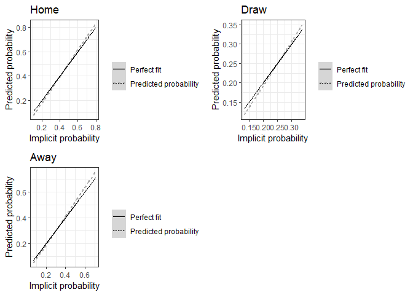

Efficient-Market-Hypothesis-on-football-data-using-R
================

A code to test the weak form of Fama’s Efficient Market Hypothesis for
football data. The method employed is based on Nyberg (2014)

You can freely obtain data at <https://www.football-data.co.uk/>

# The function

The R script contains a function that takes as inputs:

  - *home\_odds*,a vector containing the odds offered for a Home
    victory.

  - *draw\_odds*, a vector containing the odds offered for a Draw
    outcome.

  - *away\_odds*, a vector containing the odds offered for an Away
    Victory.

  - *Res*, a vector containing the Results for each match.

The output:

  - A vector *theta* of 4 parameters, 2 for each of the logit functions.

  - A floating number *p*, the p-value of a Wald test, testing whether
    the bookmakers’ implicit probabilites are unbiased estimators of the
    match outcome.

  - A function object *l*, the log likelihood function

  - A matrix *fitted.values*, containing the
    fitted values for each match.

  - A floating number *LR*, the likelihood ratio.

  - A floating number *L0*, the log-likelihood under the null hypothesis

  - A floating number *L1*, the log-likelihood of the maximum likelihood
    estimator.

  - A vector *std.errors*, the standard errors for the parameter theta.

# A simple example using data for Mexican League:

``` r
source("efficiency-test.R")

df = readr::read_csv("https://www.football-data.co.uk/new/MEX.csv")
```

    ## Parsed with column specification:
    ## cols(
    ##   Country = col_character(),
    ##   League = col_character(),
    ##   Season = col_character(),
    ##   Date = col_character(),
    ##   Time = col_time(format = ""),
    ##   Home = col_character(),
    ##   Away = col_character(),
    ##   HG = col_double(),
    ##   AG = col_double(),
    ##   Res = col_character(),
    ##   PH = col_double(),
    ##   PD = col_double(),
    ##   PA = col_double(),
    ##   MaxH = col_double(),
    ##   MaxD = col_double(),
    ##   MaxA = col_double(),
    ##   AvgH = col_double(),
    ##   AvgD = col_double(),
    ##   AvgA = col_double()
    ## )

Let’s see if the bookmakers average odds are an unbiased estimator of
the match outcome for the mexican league:

``` r
eff.test = efficiency.test(df$AvgH,df$AvgD,df$AvgA,df$Res,F)
```

    ## [1] "Likelihood:  -2708.72260115244"
    ## [1] "Likelihood (Under the Null Hypothesis): -2710.04746999873"
    ## [1] "Likelihood-Ratio 2.64973769257176 p-value:  0.618038071509696"
    ## [1] "Estimated parameters: "
    ## [1] -0.03614190  1.15133349 -0.07344744  1.12130421

It seems that there is not enough evidence to claim that the bookmakers
average odds are not an unbiased estimator of the match outcome for the
Mexican League *Liga MX*.

Let’s plot fitted values against implicit probabilities:

``` r
library(tidyverse)

fitted = eff.test$fitted.values
df <- df %>% 
  mutate(overround = 1/AvgH + 1/AvgD + 1/AvgA  ) %>% 
  mutate(p_home = 1/(AvgH*overround),
         p_draw = 1/(AvgD*overround),
         p_away = 1/(AvgA*overround),
         mult_home = fitted[,1],
         mult_draw = fitted[,2],
         mult_away = fitted[,3])


plot1 <- df %>% 
  ggplot(aes(x = p_away))+
  #geom_point(aes(color=Res))+
  geom_smooth(color="darkgrey",aes(y = mult_away,linetype="Predicted probability"))+
  geom_line(aes(y = p_away,linetype="Perfect fit"))+
  theme_bw() +
  scale_fill_grey() +
  labs(title = "Away",
       y = "Predicted probability",
       x = "Implicit probability",
       linetype = "")

plot2 <- df %>% 
  ggplot(aes(x = p_home))+
  #geom_point(aes(color=Res))+
  geom_smooth(color="darkgrey",aes(y = mult_home,linetype="Predicted probability"))+
  geom_line(aes(y = p_home,linetype="Perfect fit"))+
  theme_bw() +
  scale_fill_grey() +
  labs(title = "Home",
       y = "Predicted probability",
       x = "Implicit probability",
       linetype = "")
plot3 <- df %>% 
  ggplot(aes(x = p_draw))+
  #geom_point(aes(color=Res))+
  geom_smooth(color="darkgrey",aes(y = mult_draw,linetype="Predicted probability"))+
  geom_line(aes(y = p_draw,linetype="Perfect fit"))+
  theme_bw() +
  scale_fill_grey() +
  labs(title = "Draw",
       y = "Predicted probability",
       x = "Implicit probability",
       linetype = "")

cowplot::plot_grid(plot2,plot3,plot1)
```

<!-- -->

From the plot it seems that bookmakers tend to offer generous odds
when the match outcome is highly probable. However, the above test
says that chance alone would produce this result about 61% of the time.

# References

Nyberg, H. (2014). A Multinomial Logit-based Statistical Test of
Association Football Betting Market Efficiency.
